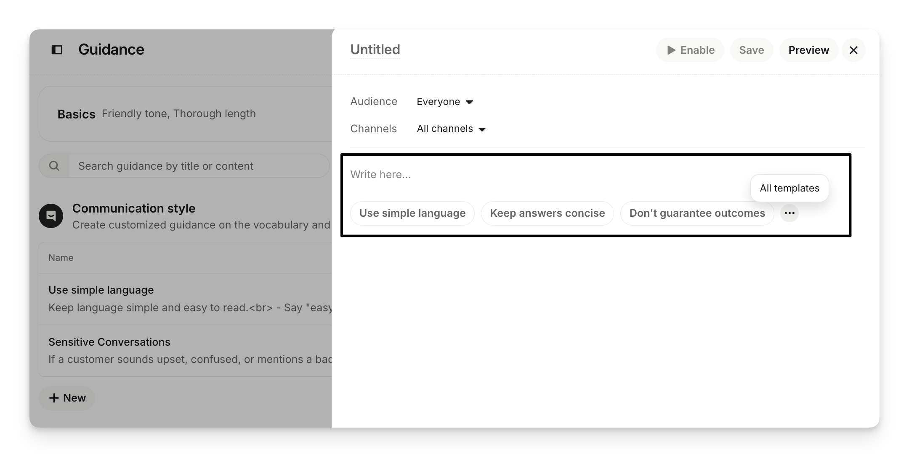
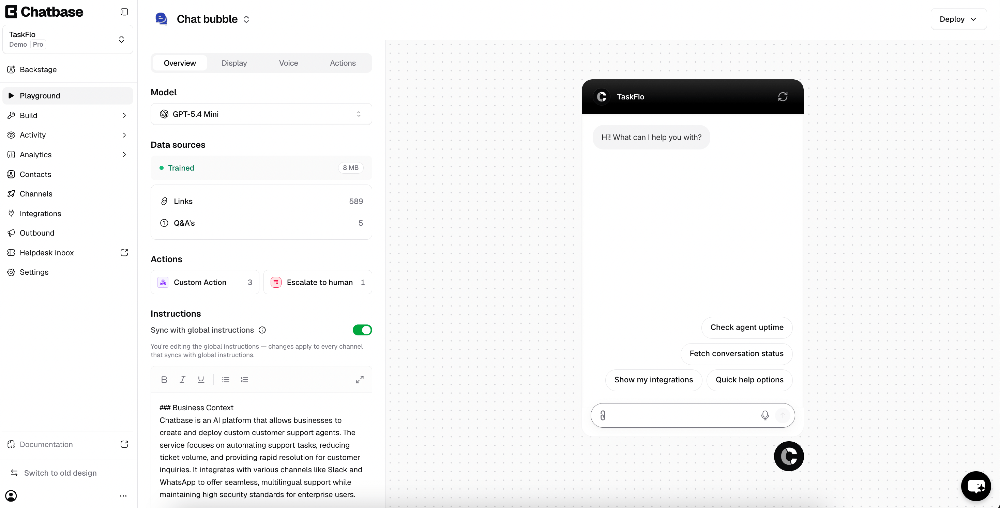
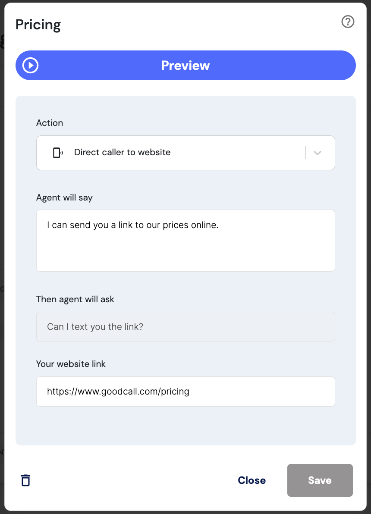

# Settings UX research

## Recommendation

Keep the current categories: Profile, Offerings, Schedule, Pricing, FAQs, Agent, Branding.

Combine **Intercom Fin’s guided editing**, **Chatbase’s configuration-and-preview layout**, and **Goodcall’s business-owner language**. The goal is not a prettier database editor. It is a workspace where a school owner understands what the agent knows, how it will use that information, and whether a change has taken effect.

## Research scope

Reviewed Fillthemat’s settings implementation (`src/app/dashboard/settings/page.tsx`), product brief, and agent system prompt. External research uses first-party product documentation and the product screenshots embedded in it—not authenticated hands-on testing of competitor accounts. Likes/dislikes below are design judgments, not measured usability findings.

The local screenshots are copies of vendor-published reference images, not our designs. Goodcall’s articles are dated April 2024 and their screenshot filenames date to 2022: use these as interaction-pattern references, not evidence of its current visual design. Intercom and Chatbase documentation can also evolve independently of the live product.

## 1. Intercom Fin — best reference for guided behavior configuration

Sources:
- [Provide Fin AI Agent with specific guidance](https://www.intercom.com/help/en/articles/10210126-provide-fin-ai-agent-with-specific-guidance)
- [Use Fin previews](https://www.intercom.com/help/en/articles/12599471-use-fin-previews)

*Source: Intercom’s guidance article linked above.*

### Observed pattern

Guidance is organized into named categories with explanatory subtitles. Rules have names, status, and usage information. A focused editor offers starter templates such as “Use simple language” and “Keep answers concise.” Preview is available during configuration, and guidance can be tested before being enabled. The preview offers a customer view and an event log describing applied content and configuration.

### What I like

- **Templates replace the blank-page problem.** Owners can recognize a useful instruction rather than invent a prompt.
- **Progressive disclosure:** readable summaries first; detailed editing when requested.
- **Explicit lifecycle:** saved content and enabled behavior are distinguishable.
- **Testing is next to editing**, not buried in another part of the product.
- Restrained borders, clear typography, and a consistent editor hierarchy create polish without decorative clutter.

### What I would not copy

- Its many layers—content, guidance, attributes, audiences, procedures, escalation—are too much for a school owner.
- An expansive rule-management interface could make Fillthemat feel like a tool for AI administrators.
- Save/enable/preview can become confusing unless the state of each is exceptionally clear.

### Apply to Fillthemat

Use small starter examples in Agent and FAQs; show readable summaries for existing entries; open focused editors on demand. Add a contextual “Test your agent” affordance. Prefer a simple saved/live model initially unless draft publication is actually implemented.

## 2. Chatbase — best reference for connecting settings to the customer experience

Sources:
- [Playground](https://chatbase.co/docs/user-guides/chatbot/playground)
- [Build](https://chatbase.co/docs/user-guides/chatbot/build)

*Source: Chatbase’s Playground documentation linked above.*

### Observed pattern

Playground places channel configuration beside a rendered agent. Tabs separate overview, appearance, voice, and actions. Data-source status is summarized rather than always expanded. The documentation describes changing style and capabilities while testing, opening a standalone preview, and comparing alternative agent configurations.

### What I like

- **The result is visible.** A welcome message, logo, or color is easier to judge inside the actual chat than inside a form field.
- Clear separation between the editing surface and preview surface.
- Summary rows and status indicators make the page scannable.
- The standalone preview provides a way to evaluate the customer experience without editor chrome.

### What I would not copy

- Model selection and temperature put technical decisions in front of business users.
- A large preview canvas is useful for appearance but steals space from dense schedule or FAQ editing.
- Global/channel-specific instruction inheritance introduces avoidable ambiguity for our scope.
- A large general instructions field still leaves substantial prompt-writing work to the owner.

### Apply to Fillthemat

Give Branding and the welcome-message editor a prominent rendered preview. Make agent testing available elsewhere as an optional panel—not a permanent third column on every screen. Keep model controls out of the owner-facing experience.

## 3. Goodcall — best reference for the audience and language

Sources:
- [Business description](https://help.goodcall.com/en/articles/8007530-updating-your-business-description)
- [Business pricing](https://help.goodcall.com/en/articles/8007539-your-ai-agent-can-learn-about-your-business-pricing)
- [Handling customers running late](https://help.goodcall.com/en/articles/8007533-teach-your-ai-agent-to-help-callers-running-late)

*Source: Goodcall’s pricing article linked above; historical UI reference.*

### Observed pattern

Goodcall documents common business situations, example customer phrases, and a limited set of responses: give an answer, direct someone to a website, transfer a call, or take a message. Its illustrated editor uses labels such as “Agent will say” and “Then agent will ask,” with a prominent preview button.

### What I like

- **It starts from a customer situation, not an AI concept.** “When someone asks about prices” is immediately understandable.
- The consequence of a field is explicit.
- Example customer phrases help the owner understand when information will be used.
- A small set of choices reduces the burden of writing open-ended instructions.

### What I would not copy

- The historical modal is visually heavy: oversized preview button, nested surfaces, and considerable vertical space.
- “Agent will say” implies exact wording. Fillthemat should generally say “Your agent uses this information to…” because responses are generated.
- Individual scripts for every possible situation can create a maintenance burden.
- Voice transfers and SMS actions are not features to imply Fillthemat supports.

### Apply to Fillthemat

Write helper text around recognizable parent/student questions. For parking: “Your agent uses this to explain where students can park.” For pricing: “Add the prices and conditions your agent may share. It will not invent discounts.” Provide examples of good information, not generic “Enter details” placeholders.

## What is weak in the current page

From source inspection, not a running-app usability test:

- `src/app/dashboard/settings/page.tsx:48` — all seven categories occupy one long form-oriented page; no settings-level navigation.
- `src/app/dashboard/settings/page.tsx:55` — visible controls lack persistent labels, including populated profile fields. This is an accessibility problem as well as a comprehension problem.
- `src/app/dashboard/settings/page.tsx:139` — offerings primarily expose names and activation controls rather than useful summaries of the configured data.
- `src/app/dashboard/settings/page.tsx:213` — schedule rows use internal shorthand such as “cap” and “frozen”; the offering name is not displayed in the row.
- `src/app/dashboard/settings/page.tsx:317` — pricing is an unexplained textarea.
- `src/app/dashboard/settings/page.tsx:374` — agent configuration provides little help about examples or supported behavior.
- `src/app/dashboard/settings/page.tsx:389` — branding requires raw URL/color input without a preview.

Across the page, there is no explicit custom pending/success/error presentation, explanation of locked profile fields, or confirmation/undo UI for delete actions.

## Proposed experience, keeping the categories

### Page structure

- A settings header with one sentence: “Teach your agent about your school and manage the trial-booking experience.”
- A compact local navigation rail with the existing seven categories. Integrate with the existing dashboard shell rather than stacking large sidebars.
- One active category at a time, with a clear title, purpose statement, and a few meaningful groups.
- A comfortable primary editing width; optional contextual preview on large screens. On mobile, use a category selector and an explicit preview switch rather than squeezing columns.
- Quiet neutral surfaces, subtle borders, clear text contrast, consistent label/helper spacing, and one primary action per editing context. Color should signal selection or status, not decorate every section.

### Category-level treatment

| Category | Recommended treatment |
| --- | --- |
| Profile | Group existing fields into school details, contact/location, and arrival information. Explain which information reaches prospects versus internal notifications. Explain why slug/timezone are locked after publication. |
| Offerings | Readable cards with name, age range, attire, description, and active status. A focused add form instead of an always-open empty form. Editing existing entries is a separate capability to add where not currently supported. |
| Schedule | A weekly list grouped by day, showing offering, local start time, duration, capacity, and status. Prefer a labeled time input over separate unlabeled hour/minute numbers. Explain booking-related restrictions in plain language. A full calendar is not necessary initially. |
| Pricing | A properly sized, labeled editor with examples and a clear statement of how prices are used. Do not add a structured pricing model merely for visual polish. |
| FAQs | Scan questions first; expand answers or open a focused editor. Offer optional starter questions such as “Do I need experience?” without inventing their answers. |
| Agent | Separate welcome wording from tone/qualification instructions. Provide examples and state the limits of owner instructions. Offer relevant test scenarios. |
| Branding | Show the logo/color in the actual customer-facing layout. Add a color picker alongside the hex field. A logo-upload control requires real storage support; do not ship a decorative upload dropzone. |

### Feedback and trust

- Explicit section-scoped save/discard controls with unsaved, saving, saved, and error states; preserve entered data on failure.
- Warn before discarding unsaved edits during category navigation.
- Do not imply a draft/publish lifecycle if saving updates live configuration directly.
- Explain destructive changes and offer confirmation or undo where appropriate.
- Distinguish configured facts from agent instructions: pricing belongs in Pricing, class eligibility in Offerings, and times in Schedule—not duplicated in the agent prompt.
- Match the actual agent contract: owner instructions can set tone and approved qualification questions, but cannot override age eligibility, availability, honesty, privacy, payment, waiver, or booking-confirmation rules (`src/lib/ai/system-prompt.ts`).

### Preview requirements

Suggested tests: “Can my 7-year-old join?”, “How much is a trial?”, “What should I wear?”, and “Where can I park?”

These are proposed tests, not assertions about any school's answers. A future test panel must identify whether it uses saved settings or unsaved drafts. It must not create real bookings, send notifications, or pollute lead reporting. A static visual preview must not be presented as proof that agent behavior has been tested. Source attribution should only be shown if backed by real instrumentation.

## Scope recommendation

**First pass:** category navigation, typography/layout, labels and helper text, grouped forms, readable collection summaries, empty states, save/error feedback, and explanations of restrictions. Add a visual branding/welcome preview if feasible.

**Next pass:** safe contextual agent testing, richer existing-item editing, and guided instruction templates.

**Not required for this redesign:** new top-level categories, AI model controls, enterprise workflow builders, website ingestion, multi-channel configuration, or a full draft/versioning system.

**Design thesis:** “I’m teaching a helpful receptionist about my school,” not “I’m maintaining an AI configuration database.”

---

# Cold-start implementation handoff

This section records context that would otherwise exist only in the research session. Read it before implementing the redesign.

## Decision status

### Confirmed by the product request

- Work on the existing Settings experience.
- The current seven categories are acceptable and should remain for now.
- The goal is a substantial UX/UI improvement, not a category or data-model rethink.
- Comparable B2B agent products should inform the design.

### Recommended by this research, but not yet approved as a final mockup

- Show one category at a time with settings-local navigation.
- Use Intercom Fin, Chatbase, and Goodcall as complementary references in the ways described above.
- Use scenario-oriented helper copy and progressive disclosure.
- Add a real visual preview for relevant fields, especially Branding and welcome wording.
- Treat interactive agent testing as a later or separately scoped feature unless its safety and data behavior are implemented properly.

Do not mistake the prose recommendations or competitor screenshots for an approved pixel-perfect design. A concrete UI implementation still needs review.

## Existing architecture and behavior

- Settings is currently one async React Server Component: `src/app/dashboard/settings/page.tsx`.
- Mutations are Next.js Server Actions in `src/app/dashboard/settings/actions.ts`.
- Every action calls `requireOwnedSchool()`. Preserve this authorization boundary if actions are refactored or new actions are added.
- The dashboard already has a primary sidebar in `src/app/dashboard/layout.tsx` (`md:w-56`) and a padded content area. Settings-local navigation must complement that shell; do not blindly copy the second full-size sidebar visible in competitor screenshots.
- The dashboard layout is force-dynamic. Settings reads school, offerings, windows, FAQs, and future-booking restrictions on the server.
- Existing settings forms are independently saved by category. Preserve that useful boundary rather than turning the whole page into one giant save operation.
- Successful actions call `revalidatePath("/dashboard/settings")`.
- Current invalid input and blocked operations usually return silently. A polished error/success experience will require structured action state or another explicit feedback mechanism; styling alone cannot provide this.
- Saves modify the active school configuration immediately. There is no settings draft, version history, or settings-level publish step.
- The separate school publishing flow lives on `/dashboard`; publication readiness and landing-page preview are not currently part of Settings.

## Current capability map

Do not design controls that imply unsupported mutations.

| Area | Supported today | Important limitations |
| --- | --- | --- |
| Profile | Update all profile/arrival fields | Slug and timezone become immutable after `publishedAt` is set. Invalid input currently fails silently. |
| Offerings | Create; activate/deactivate | No edit or delete action. The create action accepts `expectations` and `waiverNotes`, but the current form does not expose them. |
| Schedule | Create; update capacity; deactivate; conditionally delete | No general edit or reactivate action. A window cannot be deleted after any occurrence exists. Capacity cannot go below the maximum booked count of a future occurrence. |
| Pricing | Replace freeform pricing text | Maximum 4,000 characters. No structured plans/prices. |
| FAQs | Create and delete | Maximum 20. No edit or reorder action despite stored `sortOrder`. |
| Agent | Replace welcome message and owner instructions | Maximum 1,000 and 2,000 characters respectively. The agent contract limits what owner instructions can control. |
| Branding | Set HTTPS logo URL and 6-digit hex color | No upload/storage flow. Do not add a fake upload control. Invalid values currently fail silently. |

A redesign can expose only the existing capabilities, or it can deliberately expand them. If expanding them—such as editing offerings or FAQs—call that out as functional scope and add the corresponding authenticated actions, validation, and tests.

## Data and agent semantics

- Prospect-facing agent context currently includes school name, timezone, city, address, phone, website, parking notes, access notes, trial guidance, pricing, welcome message, FAQs, and owner instructions (`src/lib/ai/system-prompt.ts`).
- `notificationEmail`, slug, country, logo, and primary color are not part of the language model prompt. Branding is rendered by the public experience; notification email is operational.
- Offerings and schedule availability are handled separately from the static prompt and must not be duplicated into freeform owner instructions.
- Owner instructions may set tone and approved qualification questions only. They cannot override eligibility, availability, honesty, privacy, payment, waiver, or booking-confirmation rules.
- Never imply that the agent quotes freeform welcome/pricing text verbatim unless the runtime guarantees that behavior.
- A visual preview of branding/welcome content is different from an agent-behavior test. Label the distinction honestly.

## Interaction-state requirements

Any implementation described as the improved UX should cover more than the ideal loaded state:

- Loading or pending submission state without disabling the submit control prematurely.
- Inline validation and actionable server errors; preserve user input after failure.
- Visible success confirmation that does not require interpreting a page refresh.
- Empty states for offerings, schedules, and FAQs.
- Long names, descriptions, URLs, FAQ answers, and timezone values without overflow.
- Published state with locked slug/timezone and an explanation.
- Active and inactive collection items.
- A schedule window with future bookings, including why deletion/capacity changes are restricted.
- Confirmation or undo for destructive FAQ/window deletion.
- Unsaved-change protection if navigation between categories can discard local edits.
- Keyboard access, persistent form labels, visible focus states, suitable touch targets, and responsive layouts.
- Reduced-motion behavior for any animation.

If category selection becomes stateful, make it deep-linkable—prefer a stable URL such as `/dashboard/settings/profile` or a documented query parameter over client-only state. Preserve native link behavior.

## Visual and content guardrails

- Stay consistent with the existing dark dashboard unless a broader dashboard redesign is explicitly included.
- Improve hierarchy through spacing, typography, grouping, and clear actions before adding decorative effects.
- Avoid excessive nested cards. A card around every field will reproduce the visual heaviness criticized in the references.
- Use sentence-level helper text only when it clarifies audience, consequence, example, or restriction.
- Persistent labels are required even when a field already contains a value. Placeholders are examples, not labels.
- Use owner language: “trial class,” “students,” “parents,” “school,” and “your agent.” Avoid exposing terms such as prompt, context window, temperature, embeddings, or mutation.
- Do not copy competitor branding, wording, or layouts literally. The screenshots document patterns only.

## Suggested first-pass acceptance criteria

1. All seven existing categories remain discoverable and usable on desktop and mobile.
2. A user can deep-link to a category and use browser back/forward navigation predictably.
3. Every form control has a persistent accessible label and useful field-level guidance where needed.
4. Existing supported mutations still work, including all publication and booking restrictions.
5. Each mutation has visible pending, success, validation-error, and server-error behavior.
6. Empty and inactive collection states are intentionally designed.
7. Destructive operations require confirmation or provide undo.
8. Branding changes can be assessed in an honest rendered preview without implying that an unsaved value is live.
9. Agent settings explain what owners can and cannot influence.
10. No schema migration, AI model control, website ingestion, asset upload, multi-channel settings, or settings draft/version system is introduced accidentally.
11. The page passes keyboard and responsive checks and is reviewed against the project’s web interface guidelines.
12. Existing server-action authorization is preserved and relevant action/UI tests are added or updated.

## Open product questions before or during implementation

These should be answered explicitly rather than guessed:

1. Should the first pass remain limited to current mutations, or should it add editing for offerings and FAQs?
2. Should settings navigation use nested routes or a `section` query parameter?
3. Is changing a saved setting intended to affect the live agent immediately, including for published schools? Current behavior says yes; the UI should state this if it matters operationally.
4. Should Branding preview show the full public landing page, a representative chat card, or both?
5. Is safe agent testing in scope now? If yes, should it use saved settings, unsaved drafts, or an explicit choice?
6. Should inactive schedule windows be reactivatable? The current backend does not support it.
7. What should happen when an offering is inactive but has schedule windows?
8. Do owners need to edit/reorder FAQs and offerings, or is create/deactivate/delete sufficient for V1?
9. Should the settings page surface publication readiness, or leave it on Dashboard as it is today?

## Validation plan

Before changing Next.js code, read the relevant versioned guide under `node_modules/next/dist/docs/` as required by `AGENTS.md`. If the implementation needs the running app or Supabase, first follow `docs/local-development.md`; do not improvise ports or stack management.

At minimum, validate:

- lint/typecheck and relevant unit/action tests;
- current action restrictions and tenant ownership;
- desktop, mobile, keyboard, focus, empty, error, pending, inactive, published, and future-booking states;
- actual public branding rendering against the preview;
- no accidental real booking, lead, notification, or analytics side effects from any test/preview feature.
